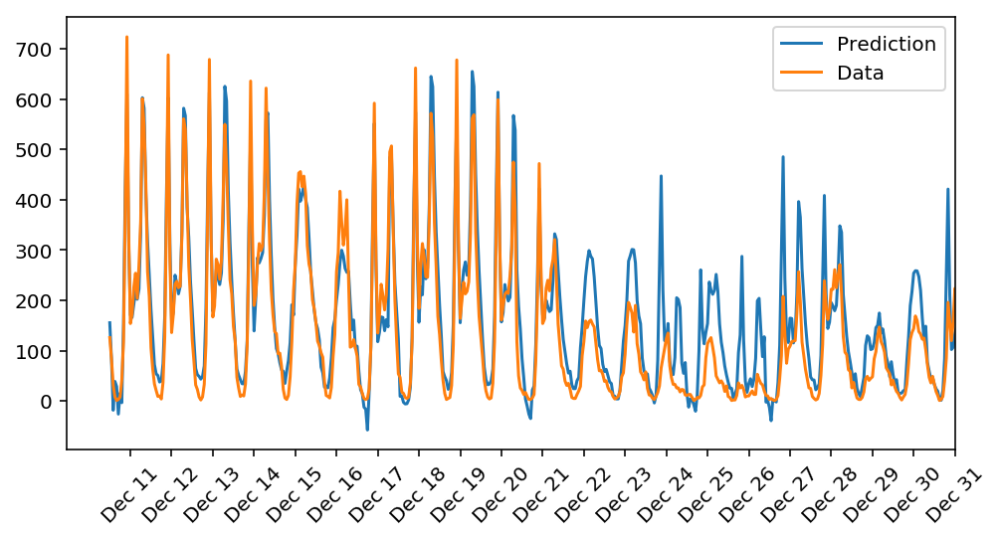

# Deep Learning - NN - Predict Bike Sharing

This is custom Numpy Neural Network implementation of a predicting daily bike rental ridership, which takes in a large number of historical data, 
train model and do prediction 

Below are comparing model prediction with actual result:

There are 2 main components of this model:

1. **Preprocessing**: Preprocess input data, derive training and testing data  
2. **Neural Network Model**: 2-Layer NN - Build custom Neural Network with numpy, train and predict daily bike rental ridership. 

## Repository 

This repository contains:
* **nn_model.py** : Custom 2 Layer Neural Network with Numpy, implemented forward pass, back propagation, updating weights and run the model  
* **predicting_bike_sharing.ipynb** : Preprocess input data, do unit testing, train, predict data and visualize result
					 
## Datasets

Datasets necessary for this implementation can be downloaded from **./Bike-Sharing-Dataset**

## List of Hyperparameters used:

* Model = **2 Layer NN**  
* Input_nodes, hidden_nodes, output_nodes, learning_rate = **number of features, 30, 1, 0.4**  
* Activation Function = **sigmoid**  
* Loss Function = **MSE**  
* Iterations  = **3800**  

